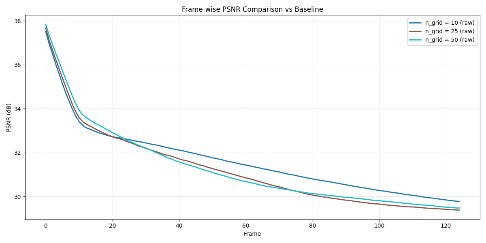

# EV-HW3: PhysGaussian

## Environment Setup
```
git clone --recurse-submodules git@github.com:XPandora/PhysGaussian.git
conda create -n PhysGaussian python=3.9 -y
conda activate PhysGaussian

conda install -c conda-forge gcc==15.1.0 -y
pip install torch torchvision torchaudio --index-url https://download.pytorch.org/whl/cu128
pip install -r requirements.txt

cp rasterizer_impl.h PhysGaussian/gaussian-splatting/submodules/diff-gaussian-rasterization/cuda_rasterizer/rasterizer_impl.h
cp simple_knn.cu PhysGaussian/gaussian-splatting/submodules/simple-knn/simple_knn.cu

pip install -e PhysGaussian/gaussian-splatting/submodules/diff-gaussian-rasterization/
pip install -e PhysGaussian/gaussian-splatting/submodules/simple-knn/

pip install gdown

cd PhysGaussian
bash download_sample_model.sh
```


## Running the Simulation
```
# cd into PhysGaussian
python gs_simulation.py --model_path ./model/ficus_whitebg-trained/ --output_path output --config ./config/ficus_config.json --render_img --compile_video --white_bg
```

if you want to have your `.mp4` converted to `.gif`, run the `mp4_to_gif.py`
```
python mp4_to_gif.py <input_mp4> <output_gif> --fps 60
```


## Tried Parameters
- materials
    - sand
    - snow
- baseline: 
    - substep_dt: 1e-4
    - n_grid: 100
    - softening: 0.1
    - grid_v_damping_scale: 0.9999
- ablation study
    - substep_dt:
        - 1e-5
        - 1e-6
    - n_grid:
        - 10
        - 25
        - 50
    - softening:
        - 0
        - 0.5
        - 1
    - grid_v_damping_scale:
        - 0.5
        - 0.99
        - 1
        - 1.5


## Results and Findings
### baseline results
<table>
<tr>
    <td align="center">
        <br/>
        <sub>sand baseline</sub>
    </td>
    <td align="center">
        <br/>
        <sub>snow baseline</sub>
    </td>
</tr>
<table>

### Ablation: `n_grid`
<table>
<tr>
    <td align="center">
        <br/>
        <sub>sand n_grid = 10</sub>
    </td>
    <td align="center">
        <br/>
        <sub>sand n_grid = 25</sub>
    </td>
    <td align="center">
        <br/>
        <sub>sand n_grid = 50</sub>
    </td>
</td>
</tr>
<table>

<table>
<tr>
    <td align="center">
        <br/>
        <sub>snow n_grid = 10</sub>
    </td>
    <td align="center">
        <br/>
        <sub>snow n_grid = 25</sub>
    </td>
    <td align="center">
        <br/>
        <sub>snow n_grid = 50</sub>
    </td>
</td>
</tr>
<table>

<table>
<tr>
<td align="center">
  <td align="center">
    <br/>
    <sub>sand n_grid psnr curve</sub>
  </td>
  <td align="center">
    <br/>
    <sub>snow n_grid psnr curve</sub>
  </td>
</td>
</tr>
<table>

`n_grid` determines the resolution of simulation. It divides the simulation space into `n_grid x n_grid x n_grid` 3D gridsm where, physical quantities are calculated and exchanged between particles and the grid.
The higher `n_grid` is, the more details could be simulated, allows for more accurate simulation of small-scale features and deformations.
The lower `n_grid` is, the coarser the simulation is, might miss details.

In the experiment of `sand` and `snow`, since sand has no interconnection from particle to particle, it scatters, while snow has interconnection force and stays connected particle-to-particle.

We can observe that scaling down the `n_grid` size highly affects `sand` scatterness. Baseline scatters easily and floats every where the simulation space. While for `n_grid = 50`, it scatters slower and retains little leaf structures. For `n_grid = 25`, it scatters litte and retains significant leaf structres, the scattering happens inside a small range. For `n_gird = 10`, it barely scatters.

Also from `snow` material, baseline is bended more significant and soon reaches its maximum bending space. While for `n_grid = 50`, it bends slower and does not create a significant lengthen on the stem of the plain. For `n_grid = 25`, it bends significantly slower and only in to a small angle. For `n_grid = 10`, it barely bends.

From the PSNR curve of sand, we can observe that `n_grid = 10` deviates much more than other two experiment while the overall PSNR drops significantly after frame 10. Since the baseline has scattered too far and has deviation too high from down scaling `n_gird` simulation.

And for PSNR curve of snow, it is more significant after frame 30, where the higher the `n_grid` resolution is, the higher the PSNR is. It is straightforward since the higher `n_grid` the more it bends and the more it is similar to baseline.


### Ablation: `substeps`

<table>
<tr>
<td align="center">
  <td align="center">
    <br/>
    <sub>sand substeps = 1e-5</sub>
  </td>
  <td align="center">
    <br/>
    <sub>sand substeps = 1e-6</sub>
  </td>
</td>
</tr>
<table>

<table>
<tr>
<td align="center">
  <td align="center">
    <br/>
    <sub>snow substeps = 1e-5</sub>
  </td>
  <td align="center">
    <br/>
    <sub>snow substeps = 1e-6</sub>
  </td>
</td>
</tr>
<table>

<table>
<tr>
<td align="center">
  <td align="center">
    <br/>
    <sub>sand substeps psnr curve</sub>
  </td>
  <td align="center">
    <br/>
    <sub>snow substeps psnr curve</sub>
  </td>
</td>
</tr>
<table>

`substeps` determines the simulation substeps scaling per frame. Each frame is consisted of smaller steps internally to improve stability and accuracy.
The higher substeps the less accurate and faster the simulation process takes. The lower the substeps is, it creates more smaller intermidiate steps for more accurate result while lenghtening the simulation time and simulated video.

By scaling `substeps` down to `1e-5`, the `sand` material can be observed that it now scatters more uniform with smoother scattering pattern. It does not act like being bended or blown in baseline. Further scaling down to `1e-6` makes the update of the frames indistinguishable, the scattering is too minor that it is not visually observable.

For `snow` material, scaling down `substeps` to `1e-5` and `1e-6` makes the bending effect of baseline disappears. It seems there are almost no changes for the material dispite the exerted force on the plant. Then we can see for a more lower `substeps`, the particles starts to connect to each other more strengthfully.

From the PSNR curve of sand, the same result occurs, the PSNR continues to lowering since the baseline scatters too much. Whereas, taking `substeps = 1e-5` makes the error higher due to the difference of scattering pattern raises the MSE loss compaired to baseline, while `substeps = 1e-6` stays static hence, has lower MSE loss.

For PSNR curve of snow, since the result is almost the same. The PSNR curve shows no significant difference between `substeps = 1e-5` and `substeps = 1e-6`.

### Ablation: `grid_v_damping_scale`

<table>
<tr>
<td align="center">
  <td align="center">
    <br/>
    <sub>sand grid_v_damping_scale = 0.5</sub>
  </td>
  <td align="center">
    <br/>
    <sub>sand grid_v_damping_scale = 0.99</sub>
  </td>
  <td align="center">
    <br/>
    <sub>sand grid_v_damping_scale = 1</sub>
  </td>
  <td align="center">
    <br/>
    <sub>sand grid_v_damping_scale = 1.5</sub>
  </td>
</td>
</tr>
<table>

<table>
<tr>
<td align="center">
  <td align="center">
    <br/>
    <sub>snow grid_v_damping_scale = 0.5</sub>
  </td>
  <td align="center">
    <br/>
    <sub>snow grid_v_damping_scale = 0.99</sub>
  </td>
  <td align="center">
    <br/>
    <sub>snow grid_v_damping_scale = 1</sub>
  </td>
  <td align="center">
    <br/>
    <sub>snow grid_v_damping_scale = 1.5</sub>
  </td>
</td>
</tr>
<table>

<table>
<tr>
<td align="center">
  <td align="center">
    <br/>
    <sub>sand grid_v_damping_scale psnr curve</sub>
  </td>
  <td align="center">
    <br/>
    <sub>snow grid_v_damping_scale psnr curve</sub>
  </td>
</td>
</tr>
<table>

`grid_v_damping_scale` determines the velocity damping scale applied at grid level. It controls how quickly the motion is dissipated from teh grid velocities during simulation.
The higher the value is, the slower the velocity is damped, which retains more velocity.
The lower the value is, the faster the velocity is turned down to zero.

From the `sand` material, the simulation shows that having scale of `0.5` damps the velocity too fast that the scattering effect is too minor to be observed. While scaling to `0.99`, which is lower than baseline for 2 decimal digits, makes the scattering effect very slow, since the speed of the particles are damped much more, the overall scattering tends to be uniform. Scaling to `1` and `1.5` which means there is no damping to the particle, the overall scattering is much significant than baseline. The velocity of particles is higher in `1` while slightly slower in `1.5`.

From the `snow` material, the simulation show that having scale below baseline results in almost no change to the video. Since the original speed of snow particle is low, damping with lower scaling results in very minor changes from frame to frame. For scaling to `1` and `1.5` the particles is not damped and bursts to the edge of the simulation slightly faster than baseline. However, since the velocity is not damped, some particles may ran all over the way in the bounding box creating the green flashing effect in generated video.

From the PSNR point of view. `sand` particle has PSNR curve almost the same in `1` and `1.5` since the scattering patteren and velocity is different to baseline. Whereas `0.99` is slightly lower than `0.5` in some time frame since it still scatters a bit. 

For `snow` particle has PSNR curve almost the same for `0.5` and `0.99` since the exerted force takes almost no effect and does not bends the plant. Whereas, `1` and `1.5` creates higher PSNR result since it bends to the same place as baseline, but trembles at about the end of simulation due to the flashing effect of the high speed particle running out of simulation bound.

### Ablation: `softening`
<table>
<tr>
<td align="center">
  <td align="center">
    <br/>
    <sub>sand softening = 0</sub>
  </td>
  <td align="center">
    <br/>
    <sub>sand softening = 0.5</sub>
  </td>
  <td align="center">
    <br/>
    <sub>sand softening = 1</sub>
  </td>
</td>
</tr>
<table>

<table>
<tr>
<td align="center">
  <td align="center">
    <br/>
    <sub>snow softening = 0</sub>
  </td>
  <td align="center">
    <br/>
    <sub>snow softening = 0.5</sub>
  </td>
  <td align="center">
    <br/>
    <sub>snow softening = 1</sub>
  </td>
</td>
</tr>
<table>

<table>
<tr>
<td align="center">
  <td align="center">
    <br/>
    <sub>sand soften psnr curve</sub>
  </td>
  <td align="center">
    <br/>
    <sub>snow soften psnr curve</sub>
  </td>
</td>
</tr>
<table>

`softening` is a parameter that smooths interaction between particles and the grid, or between particles themselves. The use is to avoid sinularities or extreme forces that can arise when particles are too close.
The higher `softening` is, the higher minimum distance in force calculation is and creates more stable results.
The lower `softening` is, the more precise is the interactions, but higher risk of instability if particles gets too close.

From the result of both `sand` and `snow`, the softening effects seem to be unfound. This may due to the interaction of particles are not too close and does not generate extreme force values that may causes instability. Whereas, the only difference between baseline is `sand` with different `softening` values changes the distance and force slightly and results in different scattering pattern.

From PSNR point of view, due to different scattering pattern in `sand` material, the PSNR significantly drops, whereas, the change is not too much, hence the PSNR is sitll higher than other experiment.

PSNR for `snow` material shows that there are very little difference between different softening value and the baseline. The PSNR value is very high.


## BONUS
To extend PhysGaussian to automatically infer and generate appropriate parameters for arbitrary target materials. We have to determine:
1. material of an object in the video
2. parameters of the detected material

It can be achieved by utilizing pretrained Large Language Image Model, which has already capable to distinguish: objects, border, and materials.
Make LLIM to label each grid of cell with the appropriate material.

After labeling the materials, there should be training for an additional MLP that determines the parameters given the label of material. It has to be trained on either simulated data with existed dataset or real world data. Since there are no ground truth for encoding space, the model should train in an autoencoder fashion. It takes in the video and labels, transform it into the hyperparameters, then simulate using PhysGaussian to generate training results. The results generated should calculate mse as loss compared to the ground truth video.

For conclusion, the pipeline could be simplified as:
1. Collect dataset for material parameters training (video only is enough)
2. Concatenate LLIM to generate labels for video
3. Train end-to-end using collected video + labels with autoencoder fashion to get parameters as the encoding vector


# Reference
```bibtex
@inproceedings{xie2024physgaussian,
    title     = {Physgaussian: Physics-integrated 3d gaussians for generative dynamics},
    author    = {Xie, Tianyi and Zong, Zeshun and Qiu, Yuxing and Li, Xuan and Feng, Yutao and Yang, Yin and Jiang, Chenfanfu},
    booktitle = {Proceedings of the IEEE/CVF Conference on Computer Vision and Pattern Recognition},
    year      = {2024}
}
```
